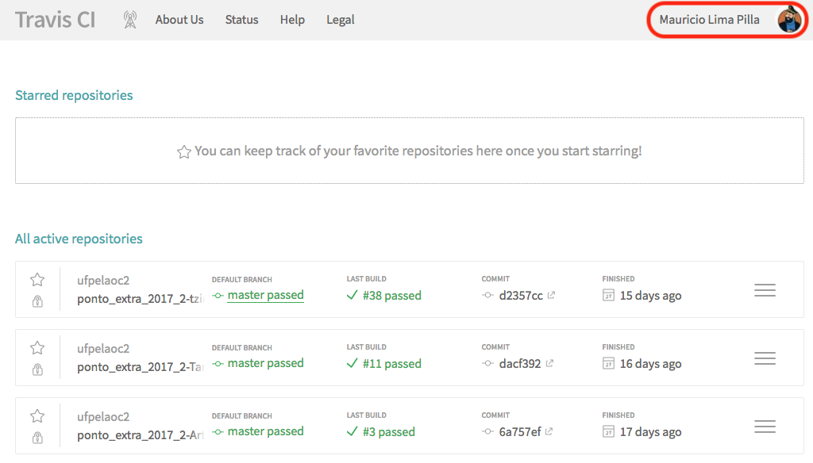
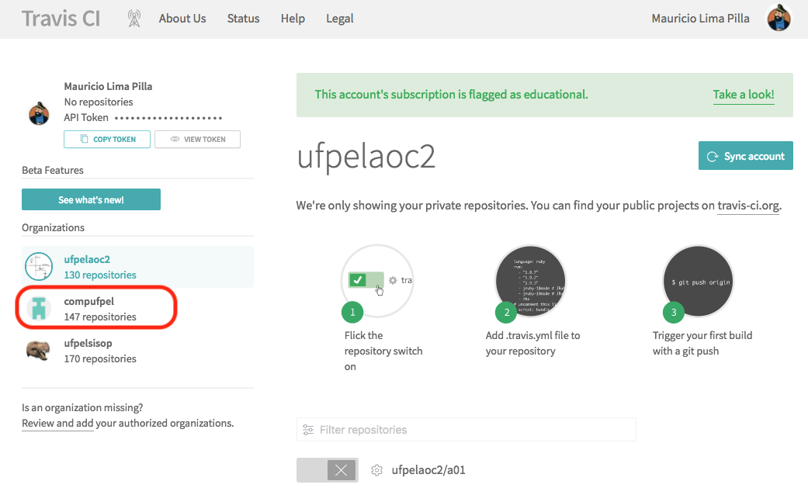
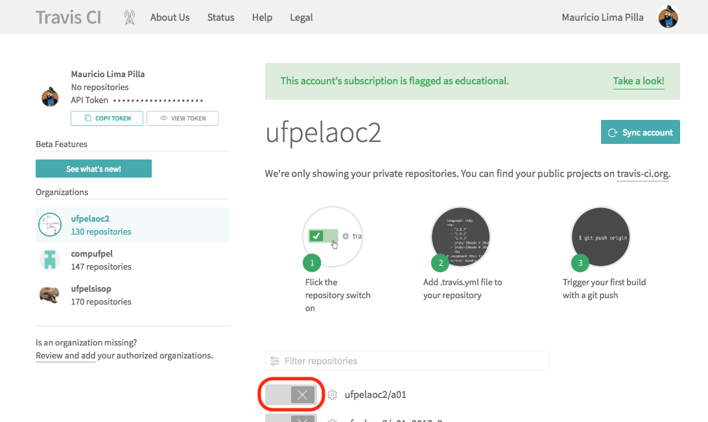

# Tutorial Github + Travis

Primeiros passos com Github e Travis CI.

## Dados do aluno

(Preencha com seus dados)

- Nome completo: 
- Username do Github: 
- Email @inf: 

## Objetivo 

O objetivo desta atividade é usar pela primeira vez a integração do Github[1] com o Travis CI[2]. 

Travis CI é um serviço de *Continuous Integration*. Cada vez que um projeto integrado ao Travis CI é enviado para o servidor Github, um gancho (ou *hook*) é disparado. O Travis clona o repositório e executa um script, conforme indicado no arquivo .travis.yml. O resultado do script é repassado de volta para o desenvolvedor.

Nesta disciplina, Github + Travis CI serão utilizados para o desenvolvimento e teste dos trabalhos. Para produzir a primeira nota dos trabalhos (sujeitas à revisão do professor), a biblioteca *simplegrade.h*[3] será usada.

## Parte 1

1. Crie uma conta no Github (se já não tiver uma).
2. Peça um desconto de estudante [aqui](https://education.github.com/discount_requests/new).
3. [Adicione uma chave pública SSH criada no seu computador no Github](https://git-scm.com/book/pt-br/v1/Git-no-Servidor-Gerando-Sua-Chave-Pública-SSH).
4. Crie uma conta no Travis CI usando o mesmo usuário do Github, autorizando o acesso à aplicação.
5. Use o _link_ disponibilizado no Google Classroom para entrar na tarefa do Github Classroom. Aceite a tarefa, um repositório será criado.
6. Volte ao Travis CI, clique no ícone do canto superior direito. 

7. Selecione a organização correta na barra da esquerda (dependendo da disciplina -- no exemplo está uma organização que não é que deve ser usada).

8. Ative a chave do repositório que está listado. 

9. Clone o repositório que será criado com esta primeira tarefa, preferencialmente usando SSH. O _link_ para ser usado está disponível no próprio repositório no Github.
11. Modifique este README.md com seus dados.
12. Faça seu primeiro commit e envie para o Github:
    * _git add README.md_
    * _git commit -m "Preenchi dados para professor"_
    * _git push -u origin master_ 
        * Este último comando envia para o Github. 

## Parte 2

1. Escreva o código que falta no arquivo _fatorial.c_
    * __IMPORTANTE__: não altere os demais arquivos!
2. Teste executando _make_ .
3. Quando estiver satisfeito com o resultado (i.e. funciona), mude o arquivo _travis.yml_ de nome para _.travis.yml_ (o ponto é MUITO IMPORTANTE), faça um _commit_ e envie para o Github.
    * _git mv travis.yml .travis.yml_
    * _git add fatorial.c_ 
    * _git commit -m "sua mensagem aqui"_
    * _git push -u origin master_
4. O resultado do _build_ no Travis CI serão enviados para o professor. Também estão disponíveis no seu _dashboard_ do Travis CI.

__IMPORTANTE__: você pode fazer quantos commits locais você quiser. Somente com o _push_ que serão enviados para o servidor. Não sobrecarregue o Travis CI e o professor com _builds_ que você sabe que não funcionam. Abuso do Travis CI pode levar à revogação da conta. 

## Referências

- [1] http://github.com
- [2] http://travis-ci.com
- [3] https://github.com/pilla/simplegrade
